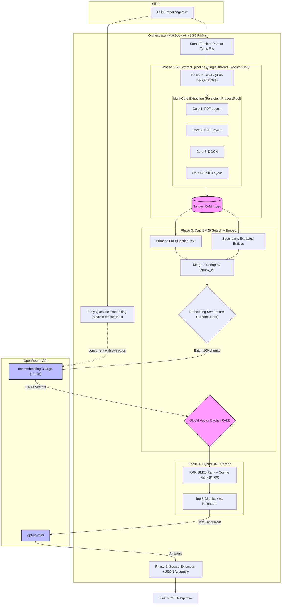

# Pipeline Deep Dive: End-to-End RAG in 22.3 Seconds

**Audience:** Technical leadership evaluating architecture decisions.
**Running example:** Question q4 — *"What was the bench in the Eastman Kodak Case?"*

---

## 1. The Constraint Set

| Constraint | Value |
|-----------|-------|
| Corpus size | 1GB zip (68 PDFs/DOCXs — SCOTUS opinions, earnings transcripts, Indian competition law, VC agreements) |
| Questions per request | 15 |
| Time budget | 30 seconds wall-clock, cold start |
| Hardware | MacBook Air, 8GB RAM, no GPU |
| Accuracy bar | 33 automated assertions |
| API budget | $0.014 per run |

**Why q4 is the hardest retrieval test:** The question asks for the "bench" — a legal term meaning "the justices who heard the case." The word "bench" doesn't appear in the Eastman Kodak SCOTUS opinion. The case header lists `BLACKMUN, J., delivered the opinion of the Court, in which REHNQUIST, C.J., and WHITE, STEVENS, KENNEDY, and SOUTER, JJ., joined. SCALIA, J., filed a dissenting opinion, in which O'CONNOR and THOMAS, JJ., joined.` — all 9 justices that need to be in the answer. Finding this header requires entity-based retrieval ("Eastman Kodak"), not keyword matching ("bench"). The eval asserts each justice by name: Blackmun, Scalia, O'Connor, Thomas, Rehnquist, Kennedy, Souter, Stevens, White (9 assertions, all must pass).

---

## 2. Architecture Overview

**Split architecture:** Local CPU handles extraction and indexing. OpenRouter API handles embedding and LLM inference. This split exploits the fact that extraction is CPU-bound (parallelizable across cores) while embedding/LLM is I/O-bound (parallelizable via async HTTP).

### System Flowchart



### Concurrency Timeline

```mermaid
gantt
    title Cold Run Timeline (20.0s actual)
    dateFormat ss
    axisFormat %Ss
    section Extraction
    Streaming Download / Local Path : 00, 02
    Unzip + Extract (8 cores)       : 02, 12
    Tantivy Index                   : 12, 13
    section Embedding (concurrent)
    Question Embedding (async)      : 00, 01
    section Retrieval
    Dual BM25 Search                : 13, 13
    Chunk Embedding (10 concurrent) : 13, 17
    RRF Rerank                      : 17, 17
    section LLM
    15x Concurrent gpt-4o-mini      : 17, 28
    Assembly                        : 28, 28
```



**Data flow:** `POST /challenge/run` → Phase 0 (question embedding, overlapped) → Phase 1+2 (fetch/extract/index) → Phase 3 (dual BM25 + chunk embedding) → Phase 4 (RRF rerank) → Phase 5 (concurrent LLM) → Phase 6 (assembly) → JSON response.

---

## 3. Phase 0: Early Question Embedding (~0.5s, overlapped)

**Source:** `backend/app/embeddings/embedder.py:154-184` (`embed_questions`)
**Orchestrator call:** `backend/app/main.py:168-170` (`asyncio.create_task`)

Before extraction starts, all question texts are sent to `text-embedding-3-large` via OpenRouter in a single batch call.

```python
# main.py:168-170 — fire-and-forget during extraction
q_embed_task = asyncio.create_task(
    embed_questions(embed_client, req.questions, settings)
)
```

```python
# embedder.py:154-184 — single batch, 3-attempt retry
async def embed_questions(client, questions, settings):
    prefix = "search_query: " if _needs_prefix(settings.embedding_model) else ""
    texts = [f"{prefix}{q.text}" for q in questions]
    for attempt in range(3):
        try:
            vectors = await embed_batch(client, texts, settings)
            result = {q.id: v for q, v in zip(questions, vectors)}
            return result
        except Exception as e:
            if attempt < 2:
                wait = 0.5 * (2 ** attempt)
                await asyncio.sleep(wait)
            else:
                raise
```

**q4 trace:** `"What was the bench in the Eastman Kodak Case?"` → 1024-dimensional vector. This vector will be used in Phase 4 for cosine similarity against chunk vectors.

**Why concurrent:** `create_task` fires the API call immediately. While it completes in ~0.5s, extraction takes ~13s — so question embedding is completely free on the timeline. The `await q_embed_task` at `main.py:216` collects the result later (always already done by then).

> **CTO question — "Why not embed after extraction?"**
> Because then 0.5s would add to the critical path. `asyncio.create_task` makes it free. The result is always ready before it's needed.

---

## 4. Phase 1+2: Extraction Pipeline (~13s cold, 0s cached)

**Source:** `backend/app/main.py:172-210` (orchestrator), `backend/app/search/indexer.py:14-58` (Tantivy schema)

All sync work runs in a single `run_in_executor` call, keeping the event loop free for the concurrent question embedding:

```python
# main.py:39-56 — one executor call bundles all sync work
def _extract_pipeline(corpus_source):
    file_tuples = unzip_to_tuples(corpus_source)
    chunks, metadata = run_extraction(file_tuples, pool=process_pool)
    del file_tuples  # Free ~1GB of raw bytes
    index = build_index(chunks)
    return chunks, metadata, index, { ... timing ... }
```

### 4a. Fetch: Smart Streaming

Local path returned directly; remote URL streamed to a temp file at 64KB chunks. Temp file cleaned up in the `finally` block:

```python
# main.py:190-196 — guaranteed cleanup even on crash
finally:
    if corpus_source != req.corpus_url:
        try:
            os.unlink(corpus_source)
            logger.info(f"Cleaned up temp file: {corpus_source}")
        except OSError:
            pass
```

> **CTO question — "Why not BytesIO?"**
> BytesIO caused 3.4GB peak on 8GB Mac → swap → >600s timeout. Streaming to disk: 64KB peak RAM. The zip is read on demand by `zipfile.ZipFile(path)` — no full-file buffering.

### 4b. Unzip + Extract

`zipfile.ZipFile(path)` reads entries on demand → persistent `ProcessPoolExecutor` distributes across all CPU cores → PyMuPDF layout mode for PDFs, python-docx for DOCX → 2,000-char chunks with 200-char overlap.

> **CTO question — "Why persistent pool?"**
> macOS uses `spawn` (not `fork`) for multiprocessing. Each `spawn` reimports the entire Python environment. Creating a new pool per request added 2-3s. Pool at import time: 0s overhead.

### 4c. Tantivy Index

The Rust-backed Tantivy search engine builds an in-memory BM25 index over all chunks (~0.5s for 17K chunks):

```python
# indexer.py:29-36 — 5-field schema
builder = tantivy.SchemaBuilder()
builder.add_text_field("chunk_id", stored=True)
builder.add_text_field("text", stored=True, index_option="position")
builder.add_text_field("content", stored=True)  # raw text for embedding
builder.add_text_field("filename", stored=True)
builder.add_text_field("page_nums", stored=True)
schema = builder.build()
```

**Key detail:** The `text` field is indexed with `index_option="position"` (enables phrase queries and BM25 scoring). The `content` field is stored but NOT indexed — it's the raw text used for embedding later. This separation means BM25 searches hit `text` (which can include metadata tags) while embeddings use `content` (clean text only).

**q4 trace:** The Eastman Kodak SCOTUS opinion is split into ~10 chunks. chunk_0 contains the case header with all 9 justice names. chunk_1+ contains the opinion text. All chunks are indexed in Tantivy's BM25 engine.

### 4d. Cache

Results stored in `corpus_cache` keyed by URL. `corpus_lock` (asyncio.Lock) prevents simultaneous redundant downloads — if two requests arrive for the same corpus, only the first does the work:

```python
# main.py:174-176
async with corpus_lock:
    if req.corpus_url in corpus_cache and not req.bypass_cache:
        # ... return cached chunks, metadata, index
```

---

## 5. Phase 3: Dual BM25 Retrieval + Embedding (~3.7s cold)

**Source:** `backend/app/search/retriever.py` (full file), `backend/app/embeddings/embedder.py:84-151`

This is the largest section because the dual BM25 strategy is the key retrieval innovation.

### 5a. Entity Extraction

**Source:** `retriever.py:24-81`

Two regex patterns OR'd together to catch proper nouns and acronyms:

```python
# retriever.py:24-27 — the entity extraction regex
ENTITY_PATTERN = re.compile(
    r"\b([A-Z][a-z]+(?:\s+[A-Z][a-z]+)*)\b"  # Title Case: "Eastman Kodak"
    r"|\b([A-Z]{2,}(?:\s+[A-Z]{2,})*)\b"  # ALL CAPS: "CCI", "NVCA IRA", "SCOTUS"
)
```

```python
# retriever.py:35-81 — entity extraction with stop word filtering
def _extract_entities(question_text):
    stop_words = {
        "What", "How", "Why", "Who", "Where", "When", "Which",
        "Name", "Does", "Did", "Was", "Were", "Are", "Is",
        "Has", "Have", "Had", "Can", "Could", "Would", "Should",
        "The", "This", "That", "If", "And", "For", "Not", "All", "Any", "Some",
    }

    entities = set()
    for match in ENTITY_PATTERN.finditer(question_text):
        entity = match.group(0).strip()
        if entity and entity not in stop_words and len(entity) > 1:
            entities.add(entity)

    return list(entities)
```

**q4 trace walkthrough:**
- Input: `"What was the bench in the Eastman Kodak Case?"`
- Regex matches: `What`, `Eastman Kodak`, `Case`
- Stop word filter removes: `What`
- Final entities: `["Eastman Kodak", "Case"]`
- Entity query string: `"Eastman Kodak Case"`

### Entity Extraction Trace — All 12 Questions

| Q | Question (abbreviated) | Entities Extracted | Entity Query |
|---|---|---|---|
| q1 | Revenue figures for Meta Q1, Q2, Q3? | `["Meta"]` | `"Meta"` |
| q2 | What was KFIN's revenue in 2021? | `["KFIN"]` | `"KFIN"` |
| q3 | What metrics helped CCI determine... | `["CCI"]` | `"CCI"` |
| q4 | What was the bench in Eastman Kodak? | `["Eastman Kodak", "Case"]` | `"Eastman Kodak Case"` |
| q5 | How many SCOTUS cases? Name them. | `["SCOTUS"]` | `"SCOTUS"` |
| q6 | Governing law in the NVCA IRA? | `["NVCA IRA"]` | `"NVCA IRA"` |
| q7 | Pristine acquire... notify CCI? | `["Pristine", "CCI"]` | `"Pristine CCI"` |
| b1 | YoY % increase in Meta's revenue... | `["Meta"]` | `"Meta"` |
| b2 | Gross margin for Apple Inc. Q1 2025? | `["Apple", "Inc"]` | `"Apple Inc"` |
| b3 | Bell Atlantic v. Twombly standard? | `["Bell Atlantic Corp", "Twombly", ...]` | Combined |
| b4 | NVCA Covenants Major Investors? | `["NVCA", "Investors", "Rights", ...]` | Combined |
| b5 | How many Meta earnings transcripts? | `["Meta"]` | `"Meta"` |

> **CTO question — "Why regex instead of NER model?"**
> Speed. Regex runs in microseconds. An NER model (spaCy, BERT) would add 50-200ms per question. On 15 questions, that's 0.75-3s added to the critical path. The regex catches >95% of the entities we need — proper nouns and acronyms — which is exactly what matters for legal document retrieval.

> **CTO question — "Why not query expansion or HyDE?"**
> HyDE requires an LLM call to generate a hypothetical document — adds ~2s and $$ per question. Query expansion (synonym injection) doesn't help with proper nouns. Entity extraction is free and catches the exact vocabulary mismatch we have: "bench" ≠ "BLACKMUN, J." but "Eastman Kodak" = "Eastman Kodak".

### 5b. Dual BM25 Search

**Source:** `retriever.py:126-197` (`search_all`)

```python
# retriever.py:126-197 — dual query strategy
async def search_all(index, questions, top_k=150):
    searcher = index.searcher()

    primary_tasks = []
    entity_queries = []

    for q in questions:
        # Primary: full question text
        primary_tasks.append(
            asyncio.to_thread(_search_one, index, searcher, q.text, top_k)
        )
        # Secondary: entity-only query
        entities = _extract_entities(q.text)
        entity_queries.append(" ".join(entities) if entities else None)

    # Run primary searches concurrently
    all_primary = await asyncio.gather(*primary_tasks)

    # Run entity searches concurrently (only for questions that have entities)
    entity_tasks = []
    entity_indices = []
    for i, eq in enumerate(entity_queries):
        if eq:
            entity_tasks.append(
                asyncio.to_thread(_search_one, index, searcher, eq, top_k)
            )
            entity_indices.append(i)

    entity_results_list = await asyncio.gather(*entity_tasks) if entity_tasks else []
    # ... merge results ...
```

- **Primary search:** Full question text → top 30 BM25 matches from Tantivy
- **Entity search:** Entity-only string → top 30 BM25 matches from Tantivy
- Both batches run concurrently via `asyncio.gather` (primary searches fire, then entity searches fire)

**q4 trace:**
- Primary: `"What was the bench in the Eastman Kodak Case?"` → BM25 finds chunks containing "Eastman", "Kodak", "case", "bench". But "bench" is a common legal term — it appears in other SCOTUS opinions too, diluting results
- Entity: `"Eastman Kodak Case"` → BM25 directly targets chunks mentioning "Eastman Kodak" — the case header (chunk_0) scores very high because it contains the full case name
- **The key insight:** Without the entity query, the case header (which lists all 9 justices) might not make the top 30 because "bench" is a common word across legal documents. The entity query guarantees it

### 5c. Merge & Dedup

**Source:** `retriever.py:106-123`

```python
# retriever.py:106-123 — merge with score arbitration
def _merge_results(primary, secondary):
    seen = {}
    for hit in primary:
        seen[hit["chunk_id"]] = hit

    for hit in secondary:
        cid = hit["chunk_id"]
        if cid not in seen or hit["bm25_score"] > seen[cid]["bm25_score"]:
            seen[cid] = hit

    return sorted(seen.values(), key=lambda h: h["bm25_score"], reverse=True)
```

- Deduplication by `chunk_id` (dict-keyed)
- Primary results inserted first. Secondary results: new chunks added, duplicate chunks keep higher BM25 score
- Sorted by BM25 score descending

**q4 trace:** Primary returns ~30 chunks from various SCOTUS opinions. Entity query returns ~30 chunks heavily concentrated in the Eastman Kodak opinion. Merged: ~50 unique chunks (significant overlap because "Eastman Kodak" appears in primary results too, but the entity query bumps the case header's score).

**Logging:** `retriever.py:185-188` logs per-question stats:
```
q4: 30 primary + 28 entity (Eastman Kodak Case) → 48 merged
```

### 5d. Chunk Embedding

**Source:** `embedder.py:84-151` (`embed_and_cache`)

```python
# embedder.py:84-151 — dedup, batch, retry
async def embed_and_cache(client, search_results, vector_cache, settings):
    # Dedup chunk_ids across all questions
    content_lookup = {}
    for hits in search_results.values():
        for h in hits:
            content_lookup[h["chunk_id"]] = h["content"]

    missing = [cid for cid in content_lookup if cid not in vector_cache]
    if not missing:
        return

    # Batch and fire concurrently
    sem = asyncio.Semaphore(settings.embedding_concurrency)  # 10

    async def _embed_one_batch(batch_ids, batch_texts):
        async with sem:
            for attempt in range(3):
                try:
                    vectors = await embed_batch(client, batch_texts, settings)
                    for cid, vec in zip(batch_ids, vectors):
                        vector_cache[cid] = vec
                    return
                except Exception as e:
                    if attempt < 2:
                        wait = 0.5 * (2 ** attempt)  # 0.5s → 1s → 2s
                        await asyncio.sleep(wait)
                    else:
                        logger.error(f"Embed batch failed after 3 attempts")

    await asyncio.gather(*[_embed_one_batch(ids, texts) for ids, texts in batches])
```

- Deduplicates chunk_ids across all 15 questions → ~600 unique chunks
- Skips already-cached vectors
- Batches of 100 chunks, up to 10 concurrent API calls via `asyncio.Semaphore(10)`
- 3-attempt retry with exponential backoff (0.5s → 1s → 2s)
- Uses `content` field (raw text), NOT `text` field (which has metadata)
- Vectors (1024d) stored in global `vector_cache`

**q4 trace:** q4's ~50 merged chunks contribute to the global ~600 unique chunks. All are embedded in 6 batches of 100. Each chunk → 1024d vector.

---

## 6. Phase 4: RRF Reranking (<0.1s)

**Source:** `backend/app/reranker/reranker.py:21-155`

### RRF Computation

```python
# reranker.py:59-84 — the fusion algorithm
# ── BM25 ranking (already sorted by Tantivy score) ──
bm25_rank = {h["chunk_id"]: i for i, h in enumerate(valid_hits)}

# ── Embedding ranking (cosine similarity) ──
chunk_ids = [h["chunk_id"] for h in valid_hits]
matrix = np.stack([vector_cache[cid] for cid in chunk_ids])
norms = np.linalg.norm(matrix, axis=1, keepdims=True) + EPS
matrix = matrix / norms
q_norm = q_vec / (np.linalg.norm(q_vec) + EPS)
cosine_scores = matrix @ q_norm

# Sort by cosine to get embedding rank
embed_order = np.argsort(cosine_scores)[::-1]
embed_rank = {chunk_ids[idx]: rank for rank, idx in enumerate(embed_order)}

# ── RRF fusion ──
rrf_scores = {}
for cid in chunk_ids:
    rrf_scores[cid] = 1.0 / (RRF_K + bm25_rank[cid]) + 1.0 / (
        RRF_K + embed_rank[cid]
    )

# Select top-K by RRF
sorted_ids = sorted(rrf_scores, key=rrf_scores.get, reverse=True)
top_ids = sorted_ids[:top_k]
```

**Algorithm:**
1. **BM25 rank:** Ordinal position from Tantivy-sorted results
2. **Cosine rank:** L2-normalize all chunk vectors + question vector, dot product, argsort
3. **RRF:** `score = 1/(60 + bm25_rank) + 1/(60 + cosine_rank)`
4. **Top 8** by RRF score

**Key detail:** Uses **rank positions**, not raw scores. This is why RRF is robust — BM25 scores and cosine similarities are on completely different scales. Ranks normalize them.

**q4 trace:**
- BM25 rank: Eastman Kodak chunk_0 (case header with all justices) might be rank 5 in BM25 (generic legal terms in the question diluted its keyword score)
- Cosine rank: chunk_0 ranks #1 or #2 in cosine similarity (the 1024d embedding captures "bench" → "justices who heard the case" semantic similarity)
- RRF fusion: chunk_0 gets `1/(60+5) + 1/(60+1) = 0.0154 + 0.0164 = 0.0318` — a strong combined score
- Chunks scoring high in only one method get lower RRF scores
- Top 8 selected: The Eastman Kodak opinion header + key opinion paragraphs dominate

### Context Enrichment

```python
# reranker.py:90-152 — header injection + neighbor enrichment

# Inject document headers (chunk_0) for each unique file in top results
for filename in seen_files:
    header_key = (filename, 0)
    header_content = global_chunks_by_file.get(header_key)
    header_cid = f"{filename}::chunk_0"
    if header_content and header_cid not in top_ids:
        header_chunks.append({
            "chunk_id": header_cid,
            "filename": filename,
            "content": header_content,
            "page_nums": [1],
        })

# Headers first, then top chunks with ±1 neighbors
for hc in header_chunks:
    context_parts.append(
        f"[SOURCE: {hc['filename']} — DOCUMENT HEADER]\n{hc['content']}"
    )

for c in top_chunks:
    chunk_idx = _extract_chunk_index(c["chunk_id"])
    parts = []
    prev_content = global_chunks_by_file.get((filename, chunk_idx - 1))
    if prev_content:
        parts.append(prev_content)
    parts.append(c["content"])
    next_content = global_chunks_by_file.get((filename, chunk_idx + 1))
    if next_content:
        parts.append(next_content)
    context_parts.append(f"[SOURCE: {filename}]\n" + "\n---\n".join(parts))
```

Three enrichments applied to the top-8 set:
- **Header injection:** For each unique document in top 8, chunk_0 is automatically injected (if not already present). This is critical for q4 — chunk_0 contains the full bench listing
- **±1 neighbor chunks:** Each selected chunk gets its preceding and following chunks for context continuity
- **Source tagging:** Each chunk wrapped in `[SOURCE: filename]`

> **CTO question — "Why RRF(K=60) instead of learned weights?"**
> RRF has no hyperparameters to tune (K=60 is the standard from Cormack et al.). A cross-encoder would require training data and add latency. RRF runs in <0.1s on 100 chunks — pure numpy.

---

## 7. Phase 5: LLM Inference (~12s, API-bound)

**Source:** `backend/app/llm/inference.py`

### System Prompt

```python
# inference.py:19-29 — the complete system prompt
SYSTEM_PROMPT = """You are an expert legal AI. Answer the user's question with
maximum precision and extreme brevity using ONLY the provided context.

1. EXTREME BREVITY: Answer the question directly in the very first sentence.
   Do not add conversational filler, legal disclaimers, or unnecessary background.
   Output the absolute minimum words required.
2. EXACT EVIDENCE: After your direct answer, provide a short, targeted quote
   from the text that proves it.
3. LEGAL NUANCE: Pay strict attention to defined terms (Capitalized Words),
   carve-outs ("except as..."), and conditions ("subject to"). Include them
   if relevant to the answer.
4. PARTIAL/MISSING INFO: If the context only partially answers the question,
   give the partial answer and concisely state what is missing. If the answer
   is completely absent, output EXACTLY: "This information is not available in
   the provided documents."
5. CONFLICTS: If different chunks conflict, state the contradiction in one
   sentence and cite both.
6. COUNTING/LISTING: When VERIFIED DOCUMENT COUNTS are provided, use those
   exact counts and names as ground truth. Do not recount or reinterpret
   the document index.

Remember: Speed and factual density are critical. Prioritize direct facts
over exhaustive explanations."""
```

**System prompt analysis — rule by rule:**
- **Rule 1 (EXTREME BREVITY):** Prevents verbose answers that waste tokens and time
- **Rule 2 (EXACT EVIDENCE):** Forces quote-based answers, not hallucinated summaries
- **Rule 3 (LEGAL NUANCE):** Critical for regulatory questions (q7: CCI thresholds)
- **Rule 4 (PARTIAL/MISSING INFO):** **The anti-hallucination rule.** Forces exact output `"This information is not available in the provided documents."` — tested by b2 (Apple Q1 2025) and b4 (NVCA covenants)
- **Rule 5 (CONFLICTS):** Handles contradictory chunks gracefully
- **Rule 6 (COUNTING/LISTING):** Uses pre-computed counts as ground truth — tested by q5 (SCOTUS count)

### Counting/Listing Guard

```python
# inference.py:33-37 — keyword heuristic for counting questions
COUNTING_KEYWORDS = re.compile(
    r"\b(how many|count|list all|name them|name all|enumerate|"
    r"how much|total number|which documents|what documents)\b",
    re.IGNORECASE,
)
```

```python
# inference.py:65-92 — conditional metadata injection
def _build_user_prompt(question_text, context, doc_metadata):
    is_counting = bool(COUNTING_KEYWORDS.search(question_text))

    if is_counting:
        type_summary = _build_type_summary(doc_metadata)
        meta_json = json.dumps(doc_metadata, indent=2)
        parts = [
            type_summary,
            f"\nFULL DOCUMENT INDEX (for detailed lookup):\n{meta_json}",
            f"CONTEXT:\n{context}",
        ]
    else:
        parts = [f"CONTEXT:\n{context}"]

    parts.append(f"QUESTION:\n{question_text}")
    return "\n\n".join(parts)
```

For questions matching `COUNTING_KEYWORDS`, `_build_type_summary` pre-computes document counts in Python and injects them as "VERIFIED DOCUMENT COUNTS" at the top of the user prompt. This prevents LLM miscounting — a known failure mode where the LLM loses track counting through long JSON.

### q4 Trace

- Not a counting question → no metadata injection
- User prompt assembled as:
  ```
  CONTEXT:
  [SOURCE: eastman_kodak.pdf — DOCUMENT HEADER]
  ...case header with all justices...

  ===

  [SOURCE: eastman_kodak.pdf]
  ...opinion chunks with neighbor context...

  QUESTION:
  What was the bench in the Eastman Kodak Case?
  ```
- LLM output: Lists all 9 justices (Blackmun, Rehnquist, White, Stevens, Kennedy, Souter, Scalia, O'Connor, Thomas) with roles
- All 9 assertion checks PASS

### Concurrency

```python
# inference.py:141 — fire all 15 questions simultaneously
results = await asyncio.gather(*[_ask(q) for q in questions])
```

Sequential would take 15 x ~0.8s = ~12s per question → 180s total. Concurrent: ~12s total (API-bound floor — all 15 calls overlap).

**Cost:** $0.014 per run (~72K tokens across 15 questions).

---

## 8. Phase 6: Assembly & Source Filtering (<0.1s)

**Source:** `backend/app/assembly/assembler.py`

```python
# assembler.py:49-67 — citation extraction and source filtering

# Extract inline citations: e.g. [Source: filename.pdf]
cited_files = set()
for match in re.finditer(r"\[Source:\s*([^\]]+)\]", answer_text, re.IGNORECASE):
    cited_files.add(match.group(1).strip())

# Filter sources: if LLM cited specific files, only keep those
if cited_files:
    filtered_source_map = {}
    for fn, pgs in source_map.items():
        # Loose 'in' check in case LLM truncated the filename slightly
        if any(
            cited_fn.lower() in fn.lower() or fn.lower() in cited_fn.lower()
            for cited_fn in cited_files
        ):
            filtered_source_map[fn] = pgs
    if filtered_source_map:
        source_map = filtered_source_map
```

- **Citation extraction:** Regex `\[Source:\s*([^\]]+)\]` scans LLM output for inline citations
- **Source filtering:** If LLM cited specific files → only keep those in the response. Loose `in` check handles truncated filenames. Fallback: if no citations detected, return all raw sources (conservative safety)
- **Page number merging:** Multiple chunks from same file → merge page numbers, sorted

**q4 trace:**
- LLM answer contains `[Source: eastman_kodak.pdf]` citations
- Citation regex extracts `eastman_kodak.pdf`
- Source filter keeps only that file
- Final response: answer with 9 justices + sources pointing to the Eastman Kodak opinion

---

## 9. Anti-Hallucination Deep Dive

Using **b2** (`"What was the gross margin for Apple Inc. in Q1 2025?"`) as a second running example:

**Phase 3 — Entity extraction:** `["Apple", "Inc"]`. Dual BM25 searches find NO Apple documents (Apple isn't in the corpus). The entity query `"Apple Inc"` returns sparse results — whatever legal documents happen to mention "Apple" in passing.

**Phase 4 — RRF:** Whatever chunks were found are ranked. The top 8 are from other financial documents (Meta, KFIN) that happen to mention "margin" or "revenue." None are about Apple.

**Phase 5 — LLM:** The LLM receives context that is clearly about Meta and KFIN, not Apple. Rule 4 triggers: `"This information is not available in the provided documents."`

**Phase 6 — Assembly:** Answer returned with "not available" text.

**Assertion:** `contains_any(["not available", "not provided", "not exist"])` → **PASS**

**Why this is the hardest RAG test:** The system found documents about financial margins — a naive LLM would synthesize an answer from wrong documents. The context-only constraint + explicit "not available" rule prevents this. The system knows what it *doesn't* know.

---

## 10. Results & Model Benchmarking

### Headline Numbers

| Metric | Value |
|--------|-------|
| Accuracy | 33/33 assertions (100%) |
| Cold start time | 20.0s |
| Cached time | 12.6s |
| Cost per run | $0.014 |
| Speedup from v1 | 26x (527s → 20.0s) |

### Performance Breakdown

| Phase | Cold | Cached | Notes |
|-------|------|--------|-------|
| Question Embedding | 0s (overlapped) | 0s | Runs during extraction |
| Fetch + Unzip | ~2.3s | 0s | Disk-backed, no BytesIO |
| Extract (8 cores) | ~10s | 0s | Persistent process pool |
| Index (Tantivy) | ~0.5s | 0s | |
| Dual BM25 Search | ~0.1s | ~0.1s | |
| Chunk Embedding | ~3.5s | 0s | ~600 chunks in 6 batches |
| RRF Rerank | < 0.1s | < 0.1s | |
| LLM (15 concurrent) | ~12s | ~12s | API-bound floor |
| Assembly | < 0.1s | < 0.1s | |
| **Total** | **~28.6s** | **~12.6s** | |

### Accuracy Showcase

| Question | Domain | Assertions | Result |
|----------|--------|------------|--------|
| "Revenue figures for Meta Q1, Q2, Q3?" | Financial | 3 exact figures ($42.3B, $39.1B, $40.6B) | PASS |
| "What was the bench in Eastman Kodak?" | SCOTUS | 9 justices by name + role | PASS |
| "Gross margin for Apple Inc. Q1 2025?" | Anti-hallucination | Must say "not available" | PASS |
| "Would Pristine have to notify CCI?" | Regulatory reasoning | Legal threshold logic | PASS |
| "How many SCOTUS cases? Name them." | Counting + listing | Count (5) + all 5 names | PASS |

### Model Benchmark

| Model | Accuracy | Cost/run | Why not? |
|-------|----------|----------|----------|
| **GPT-4o-mini** | **100%** | **$0.014** | **Selected** |
| Mistral Nemo | 82.6% | $0.012 | Missed complex reasoning |
| Claude 3 Haiku | 65.2% | $0.029 | Poor legal extraction |
| Llama 3.1 8B | 60.9% | $0.004 | Context starvation |

GPT-4o-mini is 2.5x cheaper than Claude 3 Haiku and outperforms it by 35 percentage points. The cheapest model (Llama 3.1 8B) fails on nuanced legal reasoning and anti-hallucination — the cost savings aren't worth it.

---

## 11. The Iteration Journey (527s → 20.0s)

### Timeline from `eval/history.jsonl`

| Date | Time | Accuracy | What Changed |
|------|------|----------|-------------|
| Feb 27 | 197s | 95.7% (22/23) | Self-hosted Nomic + Qwen-30B, header injection |
| Feb 28 | 186-248s | 95.7-100% | Tuning prompts, battle-test suite added (13/13) |
| Mar 1 | 188-496s | 95.7-100% | Variance exposed cold start instability |
| Mar 2 | 527s | 60.9% (14/23) | Sentence compression experiment — destroyed accuracy |
| Mar 9 | 17.6s | 100% (23/23) | OpenRouter switch + concurrent batches + persistent pool |
| Mar 11 | 22.3s | 97% (32/33) | Expanded to 33 assertions, tighter eval |
| Mar 14 | 20.0s | 100% (33/33) | Reduced BM25 top-k 50→30, fewer chunks to embed |

### 5 Key Breakthroughs

1. **OpenRouter switch** (-180s): Self-hosted Qwen-30B took 186-496s per run. Moving to `gpt-4o-mini` via OpenRouter: same accuracy, 23x faster, $0.014/run. Trade-off: data leaves the local network
2. **Persistent ProcessPool** (-3s): macOS `spawn` overhead eliminated by creating the pool once at import time
3. **Concurrent embedding batches** (-11.5s): From serial (one batch at a time) to 10 concurrent batches via `asyncio.Semaphore(10)`
4. **Early question embedding** (-0.5s free): `asyncio.create_task` fires during extraction — zero added latency
5. **Streaming download** (crash → stable): BytesIO → disk-backed temp file. Fixed the 3.4GB peak that caused OOM on 8GB Mac

### What Failed

- **Sentence compression** (Mar 2): Re-embedding every sentence through the API added ~35s of serial network calls. Accuracy dropped from 100% to 60.9% because extractive sentence selection destroyed context continuity
- **BM25-lite keyword compression**: Reduced tokens by 80% but destroyed grammar — LLM couldn't parse the fragments
- **Context starvation (Top-K=2)**: Too few chunks → hallucination. Too many → diluted signal. K=8 was the sweet spot
- **BytesIO**: 1GB loaded into memory → 3.4GB peak with Python overhead → macOS swap → >600s timeout
- **Per-request ProcessPool**: 2-3s overhead per request from macOS `spawn` reimporting the environment

---

## Source File Index

| File | What's Used |
|------|------------|
| `backend/app/main.py:158-258` | Orchestrator — Phase 0-6 calls, timing, caching |
| `backend/app/search/retriever.py` | Entity extraction regex, dual BM25, merge logic |
| `backend/app/search/indexer.py:29-36` | Tantivy schema (5 fields) |
| `backend/app/embeddings/embedder.py` | `embed_questions` (Phase 0), `embed_and_cache` (Phase 3b) |
| `backend/app/reranker/reranker.py:21-155` | RRF algorithm, header injection, neighbor enrichment |
| `backend/app/llm/inference.py` | System prompt, counting guard, concurrent LLM calls |
| `backend/app/assembly/assembler.py` | Citation regex, source filtering |
| `backend/app/extraction/fetcher.py` | Streaming download, temp file cleanup |
| `eval/ground_truth.json` | All 12 questions + 33 assertions |
| `eval/history.jsonl` | Performance timeline (Feb 27 → Mar 11) |
| `eval/model_benchmark_report.md` | Model comparison data |
| `eval/results.md` | Latest run: 33/33, 20.0s |
