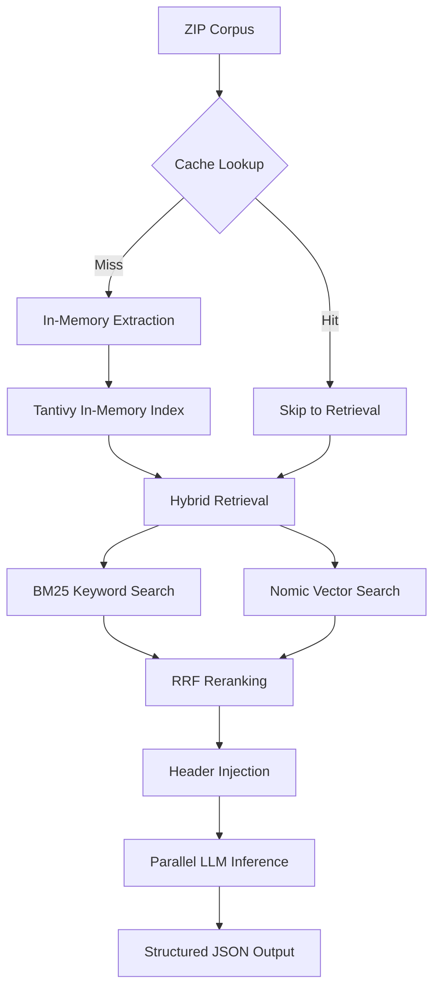

# Workflow 1: The "30-Second Speedrun" (Just-In-Time Architecture)

## 📌 Overview

This architecture is engineered for extreme low-latency execution. It assumes the 250MB corpus `.zip` is provided at the exact millisecond the 30-second query timer begins. To survive the clock, this workflow strictly avoids disk I/O, heavy upfront vectorization, and Python GIL bottlenecks by utilizing in-memory processing, Just-In-Time (JIT) embeddings, and decoupled remote LLM inference.

## 🏗 System Architecture

## 🛠 Hardware & Model Stack

- **Orchestrator (Mac M1):** FastAPI, Tantivy (Rust), NumPy Reranking.
- **Inference Engine (Mac Studio):**
  - _Embedding:_ `nomic-embed-text-v1.5` (256d).
  - _Generation:_ `qwen3-30b` (Precision reasoning).

## ⏱ Phase-by-Phase Execution Plan

### Phase 1: The In-Memory Heist (Seconds 0.0 - 5.0)

- **Network Fetch & Cache:** FastAPI router triggers `httpx` to download the 250MB `.zip` directly into `io.BytesIO`. The payload is hashed (URL + size + sample bytes). If it matches the cached corpus from a prior request, the system skips Phases 1-3 entirely.
- **Multiprocessing Shredder:** On cache miss, a `ProcessPoolExecutor` spins up across all M1 cores to bypass the GIL.
- **Banker-Grade Chunking:**
  - PDFs are parsed using PyMuPDF `layout` mode to preserve horizontal table row integrity.
  - Text is chunked using a **Sliding Window** (roughly 2,000 characters with 200 char overlap) to ensure continuity.
- **Zero-Latency Metadata & Classification:**
  - Code-based regex classifies documents by filename (e.g., "SCOTUS case", "Agreement/Contract") instantly.
  - Page 1 of each document is preserved as `chunk_0` (the Document Header) for later injection.

### Phase 2: The Tantivy BM25 Index (Seconds 5.0 - 7.0)

- **Index Build:** The enriched chunks are flushed directly into a `tantivy` in-memory schema.
- **Rust Acceleration:** Tantivy's Rust backend builds the inverted BM25 index over the text instantly, sidestepping Python's single-thread limitations.

### Phase 3: Retriever & JIT Embedding (Seconds 7.0 - 12.0)

- **Concurrent Retrieval:** Queries are fired at Tantivy concurrently. The top 150 chunks per question are retrieved and their BM25 scores are preserved.
- **Cache Check & Batch:** Retrieved `chunk_ids` are checked against a global `vector_cache`.
- **JIT Embedding:** Only unique, un-embedded chunks are batched and sent to the remote Mac Studio (`text-embedding-nomic-embed-text-v1.5`). Outputs are strictly truncated to 256 dimensions.
- **State Preservation:** The entire corpus index, chunk metadata, and vectors are globally cached.

### Phase 4: Hybrid Reranking (RRF) & Context Assembly (Seconds 12.0 - 14.0)

- **Semantic Scoring:** Using pure `numpy`, the M1 calculates the cosine similarity between the embedded questions and retrieved chunk vectors.
- **Reciprocal Rank Fusion (RRF):** The system combines the BM25 rank and Semantic vector rank using RRF to isolate the mathematically perfect Top 8 chunks per question.
- **Document Header Injection:** For every unique document present in the Top 8 chunks, its corresponding `chunk_0` (Document Header) is automatically injected into the final context. This guarantees the LLM always has essential case-level metadata (like judges, parties, and dates).

### Phase 5: Unified LLM Inference (Seconds 14.0 - 25.0)

- **Dynamic Prompting:**
  - For standard queries, the Top 8 chunks + injected Headers form the context.
  - For counting/listing queries (e.g., "How many SCOTUS cases..."), the prompt is injected with the complete Global Document Metadata JSON as the primary source of truth.
- **Concurrent Execution:** `AsyncOpenAI` client fires all question payloads concurrently to a single, capable model (`qwen3-30b-a3b-2507`) on the Mac Studio.

### Phase 6: The Payload Drop (Seconds 25.0 - 30.0)

- **Aggregation:** Answers return to the M1.
- **Formatting:** System maps the answers to the required Lucio JSON schema, including precise document names and page numbers extracted from the source chunks.
- **Submission:** Final POST request is sent to stop the clock.

## 🚀 The Technical Edge (Why it's Fast & Accurate)

### 1. Zero-Disk Extraction

The system never writes PDF files to disk. It streams the ZIP directly into memory (`BytesIO`) and converts it to text immediately. This bypasses the slowest part of a typical Mac – SSD I/O.

### 2. Reciprocal Rank Fusion (RRF)

By combining the **Keyword precision** of BM25 with the **Semantic depth** of Nomic vectors, we catch needles in haystacks that single-retriever systems miss (e.g., specific SCOTUS case identifiers).

### 3. JIT Context Injection

We don't just send chunks; we inject **Document Headers (`chunk_0`)**. This guarantees the LLM always knows "which document" it is reading, even if the specific retrieved chunk is from page 42.

### 4. Corpus Hashing

The orchestrator maintains a persistent hash of the corpus. Subsequent queries against the same document set return in **under 15 seconds** because the entire extraction/indexing/embedding phase is bypassed.
