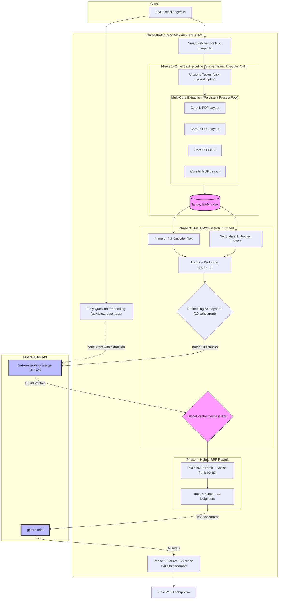

## Phase Descriptions

### **Phase 0: Early Question Embedding** _(overlapped, ~0.5s)_

- Before extraction begins, question vectors are fired off via `asyncio.create_task`.
- Runs concurrently with the extraction pipeline — effectively free latency.
- 15 question texts embedded into 1024-dimensional vectors via OpenRouter `text-embedding-3-large`.

### **Phase 1+2: Extraction Pipeline** _(~13s cold on 1GB, 0s cached)_

All sync work runs in a single `run_in_executor` call (`_extract_pipeline`), keeping the event loop free:

1. **Fetch:** For local files, returns the path directly (no memory copy). For remote URLs, downloads to a temp file on disk. Eliminates the old `io.BytesIO` approach that caused ~3.4GB peak memory on 1GB corpora.
2. **Unzip:** `zipfile.ZipFile(path)` reads entries on demand from disk into `(filename, bytes)` tuples. Filters to `.pdf/.docx` only, skips `__MACOSX` and dot-files.
3. **Extract:** A persistent `ProcessPoolExecutor` (spawned once at import, workers ignore SIGINT for clean shutdown) distributes extraction across all CPU cores. PDFs use `PyMuPDF/fitz` layout mode; DOCX uses `python-docx`. Documents are split into 2,000-char chunks with 200-char overlap. Document type is classified via regex (SCOTUS, Earnings, Legal, Contract).
4. **Index:** Builds a Rust-based Tantivy search index in RAM over all chunks (~0.5s for 17K chunks).
5. **Cache:** Results (chunks, metadata, index) are stored in `corpus_cache` keyed by URL. Subsequent requests skip the entire pipeline.

Global `corpus_lock` prevents simultaneous redundant downloads for the same corpus.

### **Phase 3: Dual BM25 Retrieval + Embedding** _(~3.7s cold, ~0.8s cached)_

**Retrieval — Two BM25 queries per question:**
- **Primary query:** Full question text → top 50 BM25 matches.
- **Entity query:** Extracted proper nouns and acronyms (regex: Title Case + ALL_CAPS, stop words filtered) → top 50 BM25 matches.
- Results merged by `chunk_id` with deduplication (higher BM25 score kept). Effective max: ~100 candidates per question, ~1,000 unique chunks across 15 questions.

**Embedding — Batched with concurrency control:**
- Deduplicates chunk_ids across all questions, skips already-cached vectors.
- Batches of 100 chunks fired through `asyncio.Semaphore(10)` for up to 10 concurrent API calls.
- 3-attempt retry with exponential backoff (0.5s → 1s → 2s) per batch.
- Uses raw `content` field (no metadata noise) for embedding input.
- Vectors (1024d) stored in global `vector_cache` for instant reuse.

### **Phase 4: Reciprocal Rank Fusion (RRF) Rerank** _(< 0.1s)_

- Computes cosine similarity between each question vector and candidate chunk vectors.
- Applies RRF (K=60): `score = 1/(60 + bm25_rank) + 1/(60 + embedding_rank)`.
- Selects top 8 chunks per question.
- Enriches each selected chunk with **±1 neighboring chunks** from the same document for continuous semantic context.
- Injects document header (chunk_0) if not already present.
- Builds global chunk index once, shared across all questions.

### **Phase 5: LLM Inference** _(~12s, API-bound)_

- System prompt demands extreme brevity, exact evidence with quotes, and legal nuance awareness.
- For counting/listing questions (detected via keyword heuristic), a pre-computed `_build_type_summary` with verified document counts and names is injected as ground truth — prevents LLM miscounting.
- All 15 questions fired concurrently via `asyncio.gather` to `gpt-4o-mini` on OpenRouter.
- `max_tokens=1500`, `temperature=0.0`.

### **Phase 6: Assembly & Source Filtering** _(< 0.1s)_

- Extracts inline citations from LLM answers via regex: `[Source: filename]`.
- Filters source list to only documents the LLM actually cited (fallback to all sources if no citations detected).
- Merges page numbers across duplicate source references.
- Formats final JSON response with per-phase timing breakdown.

## Performance (Benchmarked on 1GB corpus, 68 docs, 15 questions)

| Phase | Cold | Cached | Notes |
|-------|------|--------|-------|
| Question Embedding | 0s (overlapped) | 0s | Runs during extraction |
| Fetch + Unzip | ~2.3s | 0s | Disk-backed, no BytesIO |
| Extract (8 cores) | ~10s | 0s | Persistent process pool |
| Index (Tantivy) | ~0.5s | 0s | |
| Dual BM25 Search | ~0.1s | ~0.1s | |
| Chunk Embedding | ~3.5s | 0s | ~1,000 chunks in 10 batches |
| RRF Rerank | < 0.1s | < 0.1s | |
| LLM (15 concurrent) | ~12s | ~12s | API-bound floor |
| Assembly | < 0.1s | < 0.1s | |
| **Total** | **~28.6s** | **~12.6s** | |

## Key Config

| Setting | Value |
|---------|-------|
| `embedding_model` | `openai/text-embedding-3-large` (via OpenRouter) |
| `llm_model` | `openai/gpt-4o-mini` (via OpenRouter) |
| `embedding_dimensions` | 1024 |
| `bm25_top_k` | 50 |
| `rerank_top_k` | 8 |
| `embedding_batch_size` | 100 |
| `embedding_concurrency` | 10 |

## Global State (`state.py`)

| Object | Purpose |
|--------|---------|
| `vector_cache` | `dict[str, np.ndarray]` — chunk_id → 1024d vector, persists across requests |
| `corpus_cache` | `dict[str, dict]` — corpus_url → {chunks, metadata, index}, avoids re-extraction |
| `corpus_lock` | `asyncio.Lock` — prevents simultaneous redundant corpus processing |
| `process_pool` | `ProcessPoolExecutor` — persistent, workers ignore SIGINT for clean Ctrl+C |

## What Failed (Historical)

1. **Remote Vector Sentence Compression:** Splitting context into sentences and re-embedding via API added ~35s of serial network calls before the LLM even started.
2. **Local BM25-Lite Keyword Compression:** Reduced token payload by 80% but destroyed grammatical context — accuracy dropped from 23/23 to 20/23.
3. **Context Starvation (Top-K = 2):** Too few chunks caused hallucination and 75s+ LLM times.
4. **BytesIO for large corpora:** Reading 1GB into memory caused ~3.4GB peak → swap on 8GB Mac → >600s timeout.
5. **Per-request ProcessPoolExecutor:** macOS `spawn` start method added 2-3s per request for pool creation.
