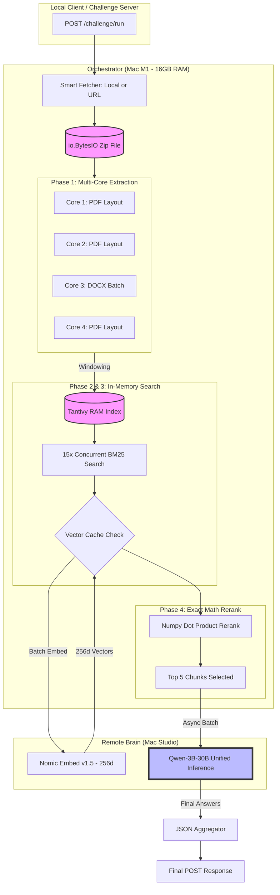

```mermaid
flowchart TD
subgraph Client["Local Client / Challenge Server"]
Trigger["POST /challenge/run"]
end

    subgraph M1["Orchestrator (Mac M1 - 16GB RAM)"]
        direction TB
        Fetch["Smart Fetcher: Local or URL"]
        RAM_Zip[("io.BytesIO Zip File")]

        subgraph Extraction["Phase 1: Multi-Core Extraction"]
            direction LR
            P1["Core 1: PDF Layout"]
            P2["Core 2: PDF Layout"]
            P3["Core 3: DOCX Batch"]
            P4["Core 4: PDF Layout"]
        end

        subgraph Search["Phase 2 & 3: In-Memory Search"]
            Tantivy[("Tantivy RAM Index")]
            BM25["15x Concurrent BM25 Search"]
            Cache{"Vector Cache Check"}
        end

        subgraph Rerank["Phase 4: Exact Math Rerank"]
            Numpy["Numpy Dot Product Rerank"]
            Top5["Top 5 Chunks Selected"]
        end
    end

    subgraph Studio["Remote Brain (Mac Studio)"]
        direction TB
        Embed["Nomic Embed v1.5 - 256d"]
        Qwen["Qwen-3B-30B Unified Inference"]
    end

    %% Connections
    Trigger --> Fetch
    Fetch --> RAM_Zip
    RAM_Zip --> Extraction
    Extraction -->|Windowing| Tantivy
    Tantivy --> BM25
    BM25 --> Cache

    %% Remote Calls
    Cache -- "Batch Embed" --> Embed
    Embed -- "256d Vectors" --> Cache
    Cache --> Numpy
    Numpy --> Top5
    Top5 -- "Async Batch" --> Qwen
    Qwen -- "Final Answers" --> Aggregator["JSON Aggregator"]

    Aggregator --> Output["Final POST Response"]

    %% Styling
    style RAM_Zip fill:#f9f,stroke:#333,stroke-width:2px
    style Tantivy fill:#f9f,stroke:#333,stroke-width:2px
    style Qwen fill:#bbf,stroke:#333,stroke-width:4px
```
