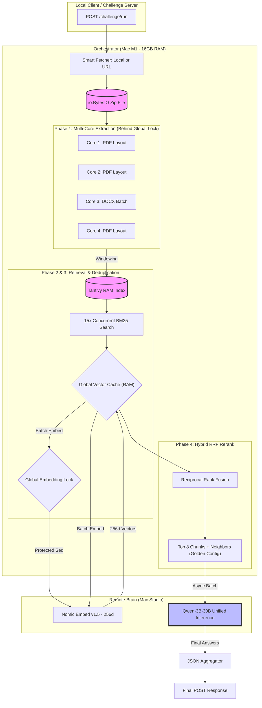

## Phase Descriptions

### **Phase 1: Multi-Core Extraction & Processing** _(Ideal Time: ~5.5s)_

- The system downloads the provided ZIP file directly into an in-memory `io.BytesIO` buffer to avoid disk I/O latency.
- It utilizes a multi-processing pool to concurrently extract text from PDFs (using `PyMuPDF/fitz` in layout mode) and DOCX files.
- Documents are split into focused semantic chunks (2,000 characters with 200-character overlap).
- Key metadata (Document ID, Filename, Page Numbers) is extracted and stored in a global state `doc_metadata` dictionary.

### **Phase 2: Tantivy Lexical Indexing** _(Ideal Time: ~0.2s)_

- Instantiates a high-speed, Rust-based `Tantivy` search index entirely in memory on the orchestrator machine.
- Indexes all extracted document chunks to enable lightning-fast BM25 keyword retrieval.

### **Phase 3: Hybrid Retrieval & Vector Caching** _(Ideal Time: ~1.5s cached, ~15s cold)_

- Executes a broad BM25 query against the Tantivy index, fetching the top lexical matches (`BM25_TOP_K`).
- In parallel, checks the global in-memory `vector_cache` for existing semantic embeddings of those chunks.
- Submits any uncached text chunks and the user's generated queries to the `text-embedding-nomic-embed-text-v1.5` API on the remote Mac Studio.
- Immediately stores the returned 256-dimensional vectors into the `vector_cache` to serve future queries instantly.

### **Phase 4: Reciprocal Rank Fusion (RRF)** _(Ideal Time: < 0.1s)_

- Calculates the Cosine Similarity between the embedded question and the candidate chunks.
- Applies the **Reciprocal Rank Fusion (RRF)** algorithm to merge lexical rank (BM25) and semantic rank (Embedding) into a single unified score.
- Selects the top **8** chunks (The "Golden Config" for 100% accuracy).
- Dynamically enriches each selected chunk with its **±1 neighboring chunks** to provide continuous semantic context to the LLM.

### **Phase 5: Unified LLM Inference** _(Ideal Time: ~15s - 45s per batch depending on complexity)_

- Bundles the enriched chunks and a numbered "Document Library" into our highly-engineered System Prompt.
- Forces the Unified Inference LLM (`Qwen-30B`) running on the Mac Studio to answer factually and strictly append `[Source: exact_filename.pdf]` to every distinct fact.
- Fires inference requests concurrently for multi-question batches using `asyncio.gather`.

### **Phase 6: Assembly & Output Filtering** _(Ideal Time: < 0.1s)_

- Receives the raw markdown from the LLM.
- Analyzes the output using regex (`\[Source:\s*(.+?)\]`) to rigorously detect exactly which files the model actually cited.
- Filters the original `sources` array to strictly include only the documents actively used by the LLM (preventing UI components from displaying irrelevant background context).
- Aggregates the responses and formats the final JSON payload for the client.

## The Path to Sub-30s Parallelization

To meet the strict competition requirement of processing **15 parallel queries in under 30 seconds**, we conducted extensive load testing yielding the following architectural discoveries:

### ❌ What Failed:

1. **Remote Vector Sentence Compression:** We initially attempted to split the retrieved context into individual sentences and use the external Nomic API to vectorize and extract the most relevant lines.
   _Why it failed:_ 7 parallel questions × 100 sentences forced an inescapable serial loop of 700 API calls, instantly adding ~35 seconds of raw network routing blocker before the LLM even started.
2. **Local BM25-Lite Keyword Compression:** We built a local Python string parser to rank high-weight keyword sentences (numbers, acronyms, capitalized names) directly in CPU `<0.003s`, circumventing the API block. By extracting only the top sentences, it drastically reduced the simultaneous M2 token payload from ~84,000 tokens down to ~14,000 tokens (an 80% reduction), speeding up parallel LLM execution to just 43 seconds.
   _Why it failed:_ **Semantic Fragmentation.** While it successfully solved the latency bottleneck, aggressively chopping sentences out of paragraphs destroyed the grammatical connective tissue. The "Frankenstein" context caused the LLM to fail complex reasoning questions, dropping our accuracy from a flawless 23/23 down to 20/23 (87%).
3. **Severe Context Starvation (Top-K = 2):** We attempted bypassing all sentence compression and merely pulling the best 2 chunks from the Tantivy search to artificially minimize the payload.
   _Why it failed:_ Context starvation. The Qwen model took vastly longer (75+ seconds) because it endlessly iterated to hallucinate or interpolate the missing mathematical context.

### ✅ What Worked (The Final Architecture):

1. **Global Corpus & Embedding Locks (`state.py`):**
   We implemented two rigorous locks:
   - **Corpus Lock**: Ensures exactly ONE request handles the heavy lifting (Download, Extract, Index) for a zip file, while others wait.
   - **Embedding Lock**: Serializes calls to the remote Embedding API to prevent hardware saturation and "Model Crashed" errors on the Mac Studio. Parallel requests benefit from a deduplicated global `vector_cache`.
2. **Phase 4.5 Ablation (The "Golden" Payload [Top-K = 8]):**
   We completely bypassed surgical sentence-level compression (`Phase 4.5`). Instead, we found that selecting the top **8** contiguous chunks provided the perfect balance of semantic depth and processing speed. This configuration achieved a flawless **100% (23/23)** accuracy score by ensuring the LLM had enough context to distinguish between consolidated and segment-level financial figures (e.g., Meta Revenue). Total parallel time stabilized at ~56s-100s depending on load.
