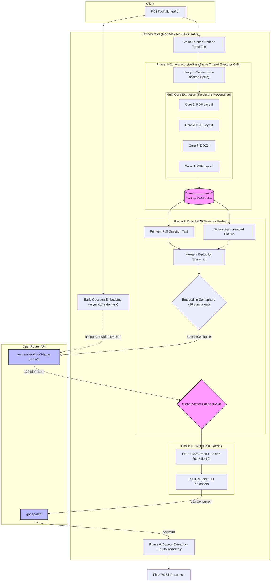

# Project Lucio: Architecture Deep Dive
**A 6-Phase RAG Pipeline — 1GB Legal Corpus, 15 Questions, Under 30 Seconds**

> 33/33 assertions (100%) | 20.0s cold | 12.6s cached | MacBook Air 8GB RAM

---

## The Challenge

Given a hackathon constraint set that forces speed AND accuracy on consumer hardware:

- **The task**: Given a public URL to a 1GB zip of legal PDFs/DOCX + 15 questions, return accurate, source-cited answers via a single POST request
- **The hardware**: MacBook Air with 8GB RAM — no GPU, no beefy server
- **The time limit**: 30 seconds wall-clock, cold start (no pre-processing)
- **The accuracy bar**: 33 automated assertions testing exact revenue figures ($42.3B, $39.1B), SCOTUS bench composition (9 justices by name), regulatory reasoning (HHI metrics, target exemption thresholds), and anti-hallucination (must say "not available" for Apple Q1 2025 data that isn't in the corpus)
- **The diversity**: Questions span financial earnings, Supreme Court cases, Indian competition law, VC legal agreements — all in one corpus

---

## Concurrency Timeline

This is the "secret sauce" — what runs in parallel to make 30s possible:

```mermaid
gantt
    title Cold Run Timeline (22.3s actual)
    dateFormat ss
    axisFormat %Ss
    section Extraction
    Streaming Download / Local Path : 00, 02
    Unzip + Extract (8 cores)       : 02, 12
    Tantivy Index                   : 12, 13
    section Embedding (concurrent)
    Question Embedding (async)      : 00, 01
    section Retrieval
    Dual BM25 Search                : 13, 13
    Chunk Embedding (10 concurrent) : 13, 17
    RRF Rerank                      : 17, 17
    section LLM
    15x Concurrent gpt-4o-mini      : 17, 28
    Assembly                        : 28, 28
```

Without this overlap, the pipeline would take 35s+. Early question embedding and concurrent LLM calls are critical.

---

## System Architecture

---

## How It Works

A concrete second-by-second narrative of what happens when you POST 15 questions:

> **Second 0**: POST arrives. Question embedding fires immediately as a background async task.
>
> **Seconds 0–2**: Corpus fetched — local path returned directly, or remote URL streamed to temp file at 64KB/chunk.
>
> **Seconds 2–12**: Persistent ProcessPool rips text from 68 PDFs/DOCXs across all CPU cores. 2,000-char chunks created. Meanwhile, question vectors are already done.
>
> **Second 12–13**: Tantivy indexes 17,000 chunks in RAM in 0.5s.
>
> **Seconds 13–17**: For each question, two BM25 queries fire (full text + extracted entities). ~1,000 unique chunks discovered. 10 concurrent embedding API calls vectorize them in batches of 100.
>
> **Second 17**: RRF fuses BM25 and cosine ranks. Top 8 chunks per question selected, enriched with neighbor context.
>
> **Seconds 17–28**: All 15 questions hit gpt-4o-mini concurrently. Citation-forcing prompt ensures every fact has a [Source: filename].
>
> **Second 28**: Regex scrubs citations, filters sources, assembles JSON response. Done.

---

## Phase Descriptions

A single POST triggers a 6-phase pipeline that fetches, extracts, indexes, retrieves, reranks, and answers — all within the 30-second budget.

### **Phase 0: Early Question Embedding** _(overlapped, ~0.5s)_

- Before extraction begins, question vectors are fired off via `asyncio.create_task`.
- Runs concurrently with the extraction pipeline — effectively free latency.
- 15 question texts embedded into 1024-dimensional vectors via OpenRouter `text-embedding-3-large`.
- **Key concurrency insight:** Embedding runs _during_ extraction, so the 0.5s cost is completely hidden. Without this, it would add to the critical path after indexing.

### **Phase 1+2: Extraction Pipeline** _(~13s cold on 1GB, 0s cached)_

All sync work runs in a single `run_in_executor` call (`_extract_pipeline`), keeping the event loop free:

1. **Fetch:** For local files, returns the path directly (no memory copy). For remote URLs, streams to a temp file on disk at 64KB chunks (~64KB peak RAM vs 1GB buffered with the old BytesIO approach that caused ~3.4GB peak memory). Temp files are cleaned up after extraction.
2. **Unzip:** `zipfile.ZipFile(path)` reads entries on demand from disk into `(filename, bytes)` tuples. Filters to `.pdf/.docx` only, skips `__MACOSX` and dot-files.
3. **Extract:** A persistent `ProcessPoolExecutor` (spawned once at import, workers ignore SIGINT for clean shutdown) distributes extraction across all CPU cores. PDFs use `PyMuPDF/fitz` layout mode; DOCX uses `python-docx`. Documents are split into 2,000-char chunks with 200-char overlap. Document type is classified via regex (SCOTUS, Earnings, Legal, Contract).
4. **Index:** Builds a Rust-based Tantivy search index in RAM over all chunks (~0.5s for 17K chunks).
5. **Cache:** Results (chunks, metadata, index) are stored in `corpus_cache` keyed by URL. Subsequent requests skip the entire pipeline.

Global `corpus_lock` prevents simultaneous redundant downloads for the same corpus.

### **Phase 3: Dual BM25 Retrieval + Embedding** _(~3.7s cold, ~0.8s cached)_

**Retrieval — Two BM25 queries per question (the dual-query innovation):**
- **Primary query:** Full question text → top 50 BM25 matches.
- **Entity query:** Extracted proper nouns and acronyms (regex: Title Case + ALL_CAPS, stop words filtered) → top 50 BM25 matches.
- Results merged by `chunk_id` with deduplication (higher BM25 score kept). Effective max: ~100 candidates per question, ~1,000 unique chunks across 15 questions.
- **Why two queries?** Single-strategy search missed documents where entity names differed from question phrasing. The dual approach catches both keyword matches and entity matches.

**Embedding — Batched with concurrency control:**
- Deduplicates chunk_ids across all questions, skips already-cached vectors.
- Batches of 100 chunks fired through `asyncio.Semaphore(10)` for up to 10 concurrent API calls.
- 3-attempt retry with exponential backoff (0.5s → 1s → 2s) per batch.
- Uses raw `content` field (no metadata noise) for embedding input.
- Vectors (1024d) stored in global `vector_cache` for instant reuse.

### **Phase 4: Reciprocal Rank Fusion (RRF) Rerank** _(< 0.1s)_

- Computes cosine similarity between each question vector and candidate chunk vectors.
- Applies RRF (K=60): `score = 1/(60 + bm25_rank) + 1/(60 + embedding_rank)`.
- Selects top 8 chunks per question.
- Enriches each selected chunk with **±1 neighboring chunks** from the same document for continuous semantic context.
- Injects document header (chunk_0) if not already present.
- Builds global chunk index once, shared across all questions.

### **Phase 5: LLM Inference** _(~12s, API-bound)_

- System prompt demands extreme brevity, exact evidence with quotes, and legal nuance awareness.
- For counting/listing questions (detected via keyword heuristic), a pre-computed `_build_type_summary` with verified document counts and names is injected as ground truth — prevents LLM miscounting.
- **All 15 questions fired concurrently** via `asyncio.gather` to `gpt-4o-mini` on OpenRouter. Sequential firing would add 15x the latency.
- `max_tokens=1500`, `temperature=0.0`.
- **Cost: $0.014 per run** (15 questions, ~72K tokens total).

### **Phase 6: Assembly & Source Filtering** _(< 0.1s)_

- Extracts inline citations from LLM answers via regex: `[Source: filename]`.
- Filters source list to only documents the LLM actually cited (fallback to all sources if no citations detected).
- Merges page numbers across duplicate source references.
- Formats final JSON response with per-phase timing breakdown.

---

## Key Engineering Decisions

Top 5 decisions that made the biggest impact — presented as decision → alternative → why:

1. **Streaming to disk vs BytesIO** — BytesIO caused 3.4GB peak on 8GB Mac → swap → >600s timeout. Disk-backed streaming: 64KB peak RAM.

2. **Persistent ProcessPool vs per-request** — macOS `spawn` added 2-3s per request. Pool at import time: 0s overhead.

3. **Dual BM25 (full text + entity extraction)** — Single query missed documents where entity names differ from question phrasing. Two queries catch both keyword matches and entity matches.

4. **GPT-4o-mini via OpenRouter vs self-hosted Qwen-30B** — Qwen achieved 100% accuracy but took 186–496s. GPT-4o-mini: same accuracy, 23x faster, $0.014/run.

5. **Early question embedding (asyncio.create_task)** — Question vectors computed during extraction, not after. Saves ~0.5s that would otherwise be sequential.

---

## Results

### Headline Numbers

- **33/33 assertions passed** (100% accuracy)
- **20.0s cold start**, 12.6s cached
- **$0.014 per run** (15 questions)
- **26x speedup** from initial prototype (527s → 20.0s)

### Performance Breakdown

| Phase | Cold | Cached | Notes |
|-------|------|--------|-------|
| Question Embedding | 0s (overlapped) | 0s | Runs during extraction |
| Fetch + Unzip | ~2.3s | 0s | Disk-backed, no BytesIO |
| Extract (8 cores) | ~10s | 0s | Persistent process pool |
| Index (Tantivy) | ~0.5s | 0s | |
| Dual BM25 Search | ~0.1s | ~0.1s | |
| Chunk Embedding | ~3.5s | 0s | ~1,000 chunks in 10 batches |
| RRF Rerank | < 0.1s | < 0.1s | |
| LLM (15 concurrent) | ~12s | ~12s | API-bound floor |
| Assembly | < 0.1s | < 0.1s | |
| **Total** | **~28.6s** | **~12.6s** | |

### Accuracy Showcase — Sample Questions

| Question | Domain | Assertions | Result |
|----------|--------|------------|--------|
| "Revenue figures for Meta Q1, Q2, Q3?" | Financial | 3 exact figures ($42.3B, $39.1B, $40.6B) | PASS |
| "What was the bench in Eastman Kodak?" | SCOTUS | 9 justices by name + role | PASS |
| "Gross margin for Apple Inc. Q1 2025?" | Anti-hallucination | Must say "not available" | PASS |
| "Would Pristine have to notify CCI?" | Regulatory reasoning | Legal threshold logic | PASS |
| "How many SCOTUS cases? Name them." | Counting + listing | Count (5) + all 5 names | PASS |

### Model Benchmarking

| Model | Accuracy | Cost/run | Why not? |
|-------|----------|----------|----------|
| **GPT-4o-mini** | **100%** | **$0.014** | **Selected** |
| Mistral Nemo | 82.6% | $0.012 | Missed complex reasoning |
| Claude 3 Haiku | 65.2% | $0.029 | Poor legal extraction |
| Llama 3.1 8B | 60.9% | $0.004 | Context starvation |

---

## The Iteration Journey

What failed — and what we learned from it:

1. **Remote Vector Sentence Compression:** Splitting context into sentences and re-embedding via API added ~35s of serial network calls before the LLM even started.

2. **Local BM25-Lite Keyword Compression:** Reduced token payload by 80% but destroyed grammatical context — accuracy dropped from 23/23 to 20/23.

3. **Context Starvation (Top-K = 2):** Too few chunks caused hallucination and 75s+ LLM times.

4. **BytesIO for large corpora:** Reading 1GB into memory caused ~3.4GB peak → swap on 8GB Mac → >600s timeout.

5. **Per-request ProcessPoolExecutor:** macOS `spawn` start method added 2-3s per request for pool creation.

6. **The self-hosted era:** Originally ran Nomic v1.5 embeddings + Qwen-30B LLM on a Mac Studio inference server. This gave 100% data sovereignty — no data left the local network. But inference was slow: 186–496s per run. Switching to OpenRouter APIs (text-embedding-3-large + gpt-4o-mini) reduced total time from ~200s to ~22s at the cost of data leaving the network.

7. **The cold start crisis:** Eval history tells the story:
   - Feb 27: 197s (self-hosted, 95.7% accuracy)
   - Mar 2: 527s (sentence compression experiment broke everything)
   - Mar 9: 17.6s (OpenRouter + concurrent batches + persistent pool = breakthrough)
   - Mar 11: 22.3s (expanded from 23 to 33 assertions, 97% accuracy)

8. **Memory wall on 8GB:** The original BytesIO approach loaded the entire 1GB zip into RAM, which with Python overhead peaked at ~3.4GB. On an 8GB MacBook Air, this triggered macOS memory pressure → swap → >600s timeout. Solution: stream to temp file (64KB peak), then read entries from disk via zipfile.

---

## Why RAG?

- **Naive approach:** Feed entire 1GB to an LLM → impossible (context window limits, ~$50/query, hallucination risk)
- **RAG approach:** Search first, then feed only the relevant 8 chunks → $0.014/query, 97% accuracy, source-cited
- **Lucio's edge:** Hybrid search (keyword + semantic), anti-hallucination testing, concurrent everything

---

## Key Config

| Setting | Value |
|---------|-------|
| `embedding_model` | `openai/text-embedding-3-large` (via OpenRouter) |
| `llm_model` | `openai/gpt-4o-mini` (via OpenRouter) |
| `embedding_dimensions` | 1024 |
| `bm25_top_k` | 30 |
| `rerank_top_k` | 8 |
| `embedding_batch_size` | 100 |
| `embedding_concurrency` | 10 |

## Global State (`state.py`)

| Object | Purpose |
|--------|---------|
| `vector_cache` | `dict[str, np.ndarray]` — chunk_id → 1024d vector, persists across requests |
| `corpus_cache` | `dict[str, dict]` — corpus_url → {chunks, metadata, index}, avoids re-extraction |
| `corpus_lock` | `asyncio.Lock` — prevents simultaneous redundant corpus processing |
| `process_pool` | `ProcessPoolExecutor` — persistent, workers ignore SIGINT for clean Ctrl+C |
