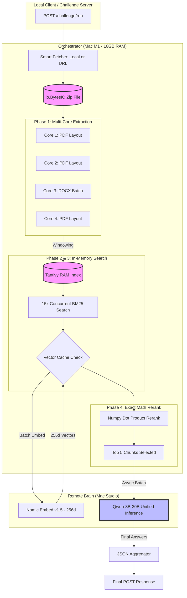

## Phase Descriptions

### **Phase 1: Multi-Core Extraction & Processing**

- The system downloads the provided ZIP file directly into an in-memory `io.BytesIO` buffer to avoid disk I/O latency.
- It utilizes a multi-processing pool to concurrently extract text from PDFs (using `pypdf`) and DOCX files (using `python-docx`).
- Documents are split into overlapping semantic chunks (currently 4000 characters).
- Key metadata (Document ID, Filename, Page Numbers) is extracted and stored in a global state `doc_metadata` dictionary.

### **Phase 2: Tantivy Lexical Indexing**

- Instantiates a high-speed, Rust-based `Tantivy` search index entirely in memory on the orchestrator machine.
- Indexes all extracted document chunks to enable lightning-fast BM25 keyword retrieval.

### **Phase 3: Hybrid Retrieval & Vector Caching**

- Executes a broad BM25 query against the Tantivy index, fetching the top lexical matches (`BM25_TOP_K`).
- In parallel, checks the global in-memory `vector_cache` for existing semantic embeddings of those chunks.
- Submits any uncached text chunks and the user's generated queries to the `text-embedding-nomic-embed-text-v1.5` API on the remote Mac Studio.
- Immediately stores the returned 256-dimensional vectors into the `vector_cache` to serve future queries instantly.

### **Phase 4: Reciprocal Rank Fusion (RRF)**

- Calculates the Cosine Similarity (via `numpy` dot products) between the embedded question and the embedded chunks.
- Applies the RRF algorithm to mathematically merge the lexical rank (BM25) and semantic rank (Embedding) into a single, unified unified score.
- Trims the list down to the absolute best sequence of chunks (`RERANK_TOP_K`).
- Dynamically enriches the selected chunks by injecting their document's `chunk_0` (the header/title) to restore missing global context.

### **Phase 5: Unified LLM Inference**

- Bundles the enriched chunks and a numbered "Document Library" into our highly-engineered System Prompt.
- Forces the Unified Inference LLM (`Qwen-30B`) running on the Mac Studio to answer factually and strictly append `[Source: exact_filename.pdf]` to every distinct fact.
- Fires inference requests concurrently for multi-question batches using `asyncio.gather`.

### **Phase 6: Assembly & Output Filtering**

- Receives the raw markdown from the LLM.
- Analyzes the output using regex (`\[Source:\s*(.+?)\]`) to rigorously detect exactly which files the model actually cited.
- Filters the original `sources` array to strictly include only the documents actively used by the LLM (preventing UI components from displaying irrelevant background context).
- Aggregates the responses and formats the final JSON payload for the client.
